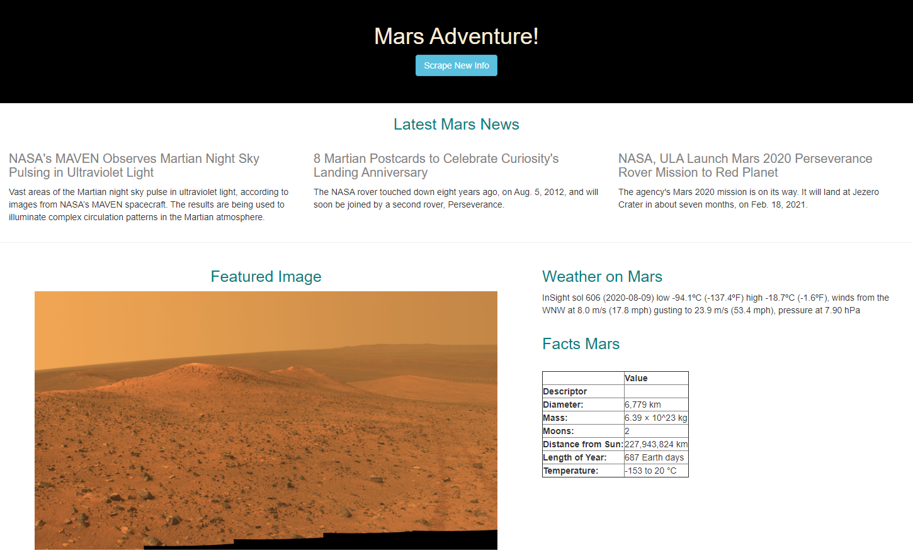
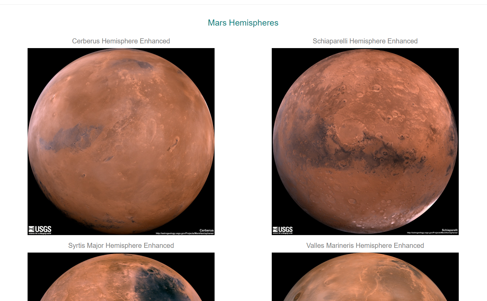

# Web Scraping challenge - Mission to Mars

In this challenge, I will build a web application that scrapes various websites for data related to the Mission to Mars and displays the information in a single HTML page. The following outlines the approach:

## Step 1 - Scraping

* See Jupyter Notebook file called `mission_to_mars.ipynb` for scraping and analysis steps. 

### NASA Mars News

A. Scrapes the [NASA Mars News Site](https://mars.nasa.gov/news/) and collects the latest News Title and Paragraph Text. 

### JPL Mars Space Images - Featured Image

B1. Visits the url for JPL Featured Space Image [here](https://www.jpl.nasa.gov/spaceimages/?search=&category=Mars).

B2. Navigates the site and find the image url for the current Featured Mars Image and assigns the url string to a variable called `featured_image_url`.

### Mars Weather

C. Visits the Mars Weather twitter account [here](https://twitter.com/marswxreport?lang=en) and scrapes the latest Mars weather tweet from the page. Saves the tweet text for the weather report as a variable called `mars_weather`.

### Mars Facts

D1. Visits the Mars Facts webpage [here](https://space-facts.com/mars/) and uses Pandas to scrape the table containing facts about the planet including Diameter, Mass, etc.
D2. Saves a HTML table string as `mars_facts`.

### Mars Hemispheres

E1. Visits the USGS Astrogeology site [here](https://astrogeology.usgs.gov/search/results?q=hemisphere+enhanced&k1=target&v1=Mars) to obtain high resolution images for each of Mar's hemispheres.

E2. Savse both the image url string for the full resolution hemisphere image, and the Hemisphere title containing the hemisphere name. Uses a Python dictionary to store the data using the keys `img_url` and `title`.

## Step 2 - MongoDB and Flask Application

A MongoDB with Flask templating is used to create a new HTML page that displays all of the information that was scraped from the URLs above. See `docs` folder.

    * see route called `/scrape` that imports `scrape_mars.py` script and calls the `scrape` function.

